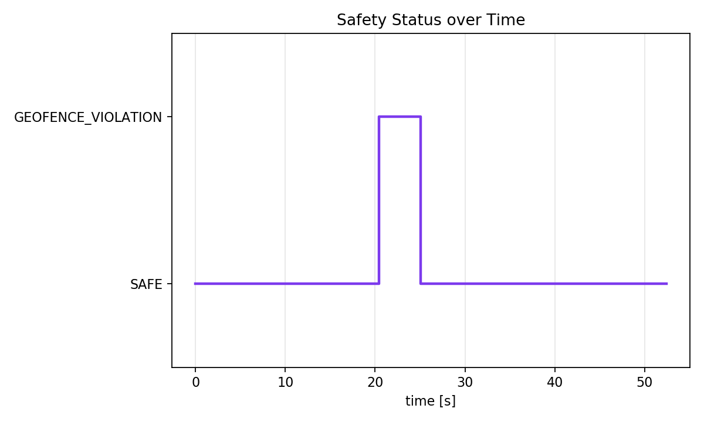

# Runtime Safety Monitoring for Autonomous UAV Missions

## Overview

This project implements a small runtime safety-monitoring prototype for autonomous UAV missions. A simulated UAV follows a waypoint-based mission while a safety monitor checks operational constraints such as altitude limits, geofence boundaries, battery level, and mission timeout. If a violation is detected, the monitor logs the event and recommends a safe response such as return-to-home or landing.

The project is intended as preparation for UAV autonomy work involving ROS2, PX4/Gazebo simulation, log-data analysis, and safe operation of autonomous drones.

## Motivation

Autonomous UAVs need onboard software that can detect unsafe mission states during operation. This repository focuses on a narrow but relevant subsystem: a runtime monitor that receives UAV state data, checks safety constraints, produces a safety status, and stores evidence for simulation-based validation.

## System Architecture


```text
Mission Simulator
        |
        v
UAV State Data
        |
        v
Runtime Safety Monitor
        |
        v
Safety Status / Recommended Action
        |
        v
CSV Log File
        |
        v
Python Analysis and Plots
```

## Safety Rules

| Rule | Limit | Safety status | Recommended action |
| --- | --- | --- | --- |
| Altitude limit | `z > 30 m` | `ALTITUDE_LIMIT_VIOLATION` | `LAND` |
| Geofence boundary | `x/y` outside `[-50, 50] m` | `GEOFENCE_VIOLATION` | `RETURN_TO_HOME` |
| Low battery | `battery < 20%` | `LOW_BATTERY` | `LAND` |
| Mission timeout | `time > 120 s` | `MISSION_TIMEOUT` | `RETURN_TO_HOME` |

The current safety limits are stored in [config/safety_limits.json](config/safety_limits.json).

## Implementation

The first version is intentionally lightweight and does not require PX4, Gazebo, or ROS2. It contains:

- [src/mission_simulator.py](src/mission_simulator.py): generates simulated UAV state samples for normal and unsafe waypoint missions.
- [src/safety_monitor.py](src/safety_monitor.py): evaluates altitude, geofence, battery, and mission-time constraints.
- [src/logger.py](src/logger.py): writes UAV states and safety decisions to CSV.
- [src/main.py](src/main.py): runs the normal and unsafe scenarios.
- [analysis/analyze_logs.py](analysis/analyze_logs.py): summarizes mission logs.
- [analysis/plot_mission.py](analysis/plot_mission.py): creates validation plots.

## Results

The normal mission remains inside the geofence and below the altitude limit, so all samples are `SAFE`.

The unsafe mission intentionally crosses the geofence at `x > 50 m`, which produces `GEOFENCE_VIOLATION` and recommends `RETURN_TO_HOME`.

Generated figures:




## How to Run

From the repository root:

```bash
python3 src/main.py
python3 analysis/analyze_logs.py
python3 analysis/plot_mission.py
python3 analysis/create_architecture_diagram.py
```

Expected generated files:

```text
data/normal_mission.csv
data/unsafe_mission.csv
results/normal_trajectory_plot.png
results/normal_altitude_plot.png
results/normal_battery_plot.png
results/normal_safety_events_plot.png
results/unsafe_trajectory_plot.png
results/unsafe_altitude_plot.png
results/unsafe_battery_plot.png
results/unsafe_safety_events_plot.png
docs/architecture.png
```

## Environment Setup

Recommended local setup on a fresh machine:

```bash
git clone https://github.com/<your-github-username>/uav-runtime-safety-monitor.git
cd uav-runtime-safety-monitor
python3 -m venv .venv
source .venv/bin/activate
python -m pip install -r requirements.txt
python src/main.py
```

This repository currently uses only Python, NumPy-compatible numerical data, and matplotlib plotting. The analysis code avoids pandas so that the first version remains easy to run in restricted environments.

## Relevance to UAV Autonomy

This project is designed as a small onboard autonomy component, not as a full drone simulator. It connects to safe UAV operation through:

- runtime monitoring of mission constraints,
- safety-status and recommended-action generation,
- simulation-based validation,
- log-data analysis,
- a path toward ROS2/PX4/Gazebo integration.

## Future Work

- Convert the safety monitor into a ROS2 `rclpy` node.
- Subscribe to `/uav/state` and publish `/uav/safety_status`.
- Add PX4 or ArduPilot SITL integration.
- Add Gazebo-based validation scenarios.
- Add position-deviation, velocity-limit, GPS-loss, and sensor-fault checks.

