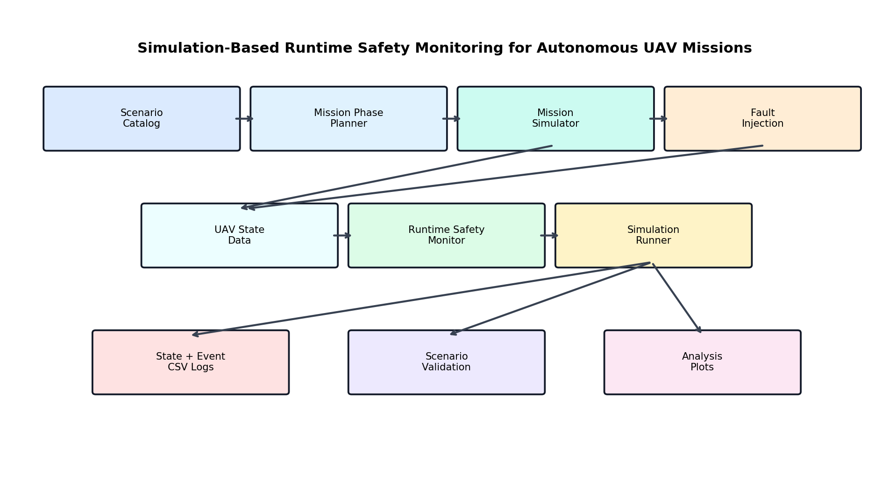
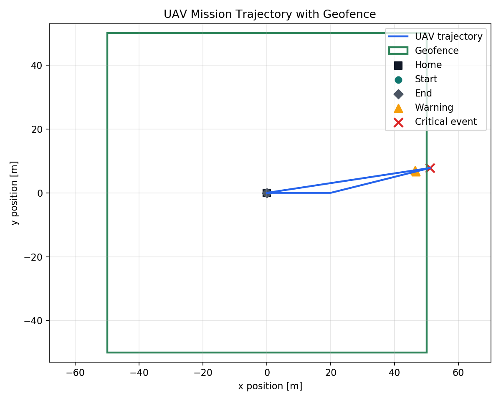
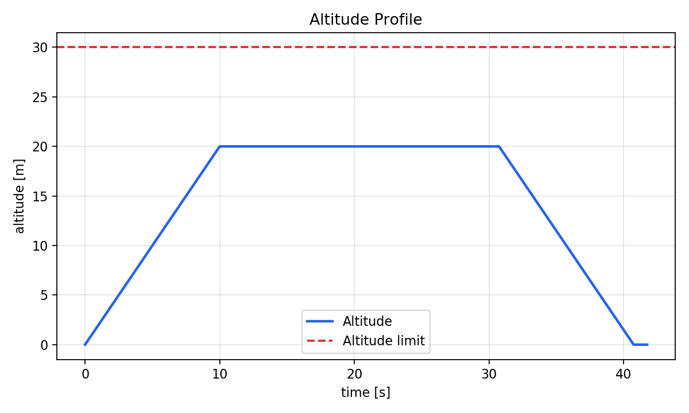
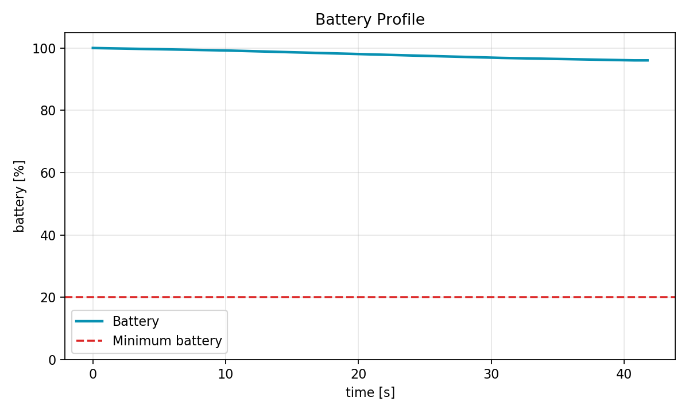
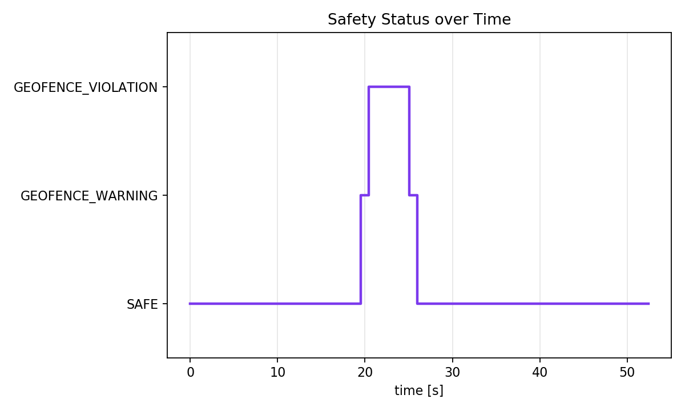
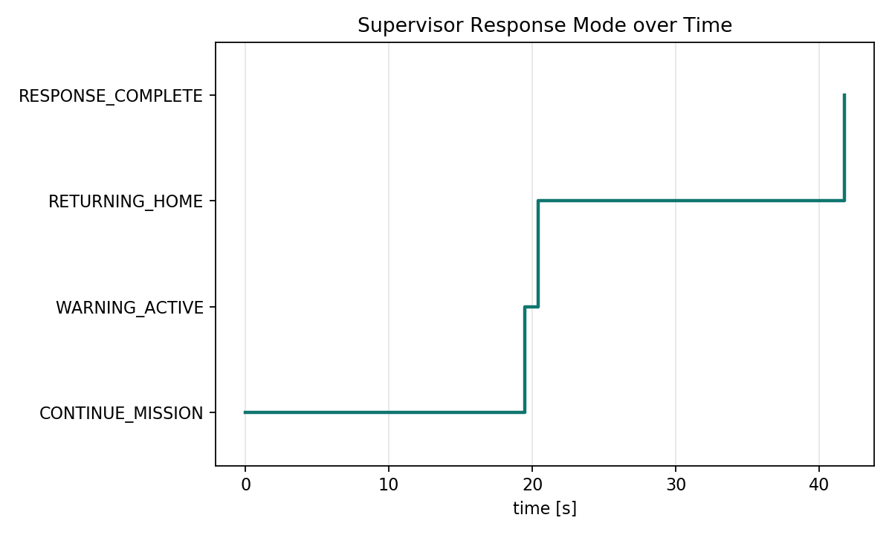
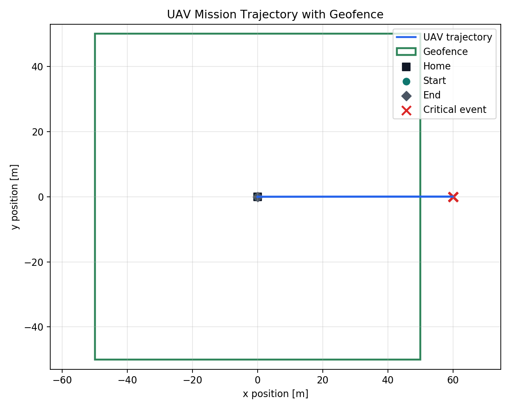
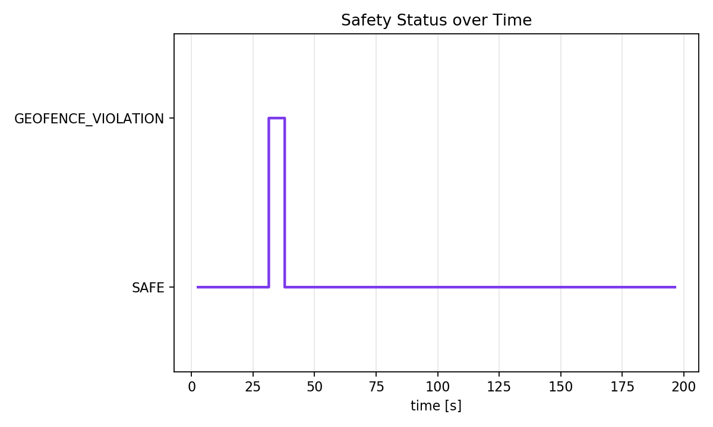
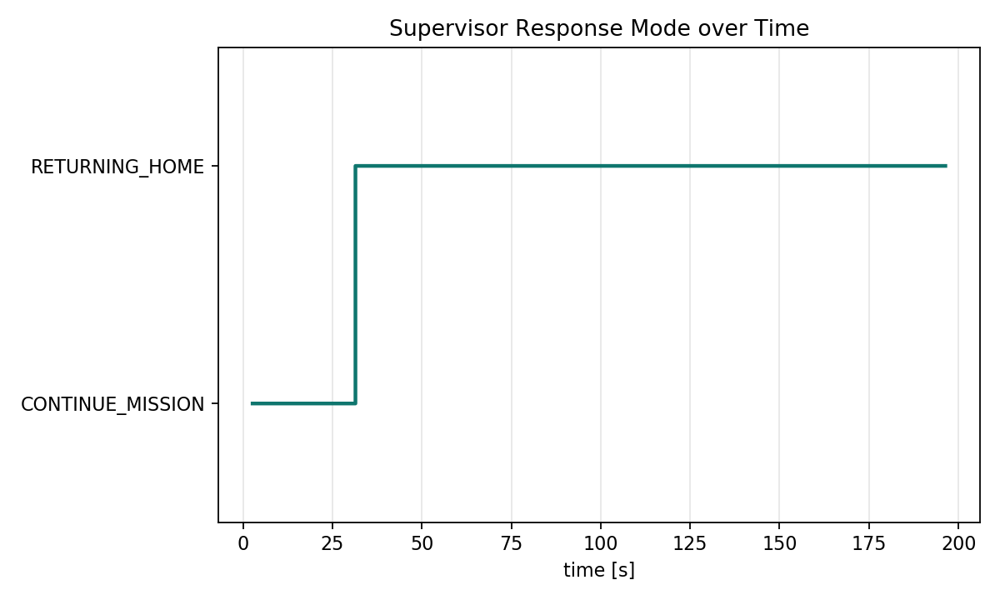

# Runtime Safety Monitoring for Autonomous UAV Missions

## Overview

This project implements a small runtime safety-monitoring prototype for autonomous UAV missions. A simulated UAV follows waypoint-based missions while a safety monitor checks operational constraints such as altitude limits, geofence boundaries, battery level, mission timeout, and stale state updates. If a warning or violation is detected, the monitor logs the event and recommends a safe response such as warning, return-to-home, or landing.

The project is intended as preparation for UAV autonomy work involving ROS2, PX4/Gazebo simulation, log-data analysis, and safe operation of autonomous drones.

## Motivation

Autonomous UAVs need supervisory onboard software that can detect unsafe mission states during operation. This repository focuses on a narrow but relevant subsystem: a runtime monitor that receives UAV state data, checks safety constraints, produces a safety status and severity, and stores validation evidence from repeatable simulation scenarios.

## System Architecture



```text
Scenario Catalog
        |
        v
Mission Phase Planner
        |
        v
UAV State Data
        |
        v
Runtime Safety Monitor
        |
        v
Safety Status / Severity / Recommended Action
        |
        v
Mission Supervisor
        |
        v
Response Mode / Active Response
        |
        v
Simulation Runner
        |
        v
State Log + Event Log + Scenario Validation
        |
        v
Python Analysis and Plots
```

## Safety Rules

| Rule | Limit | Safety status | Severity | Recommended action |
| --- | --- | --- | --- | --- |
| Altitude warning | `z >= 25 m` and `z <= 30 m` | `ALTITUDE_WARNING` | `WARNING` | `WARNING` |
| Altitude limit | `z > 30 m` | `ALTITUDE_LIMIT_VIOLATION` | `CRITICAL` | `LAND` |
| Geofence warning | within `5 m` of boundary | `GEOFENCE_WARNING` | `WARNING` | `WARNING` |
| Geofence boundary | `x/y` outside `[-50, 50] m` | `GEOFENCE_VIOLATION` | `CRITICAL` | `RETURN_TO_HOME` |
| Low battery | `battery < 20%` | `LOW_BATTERY` | `CRITICAL` | `LAND` |
| Mission timeout | `time > 120 s` | `MISSION_TIMEOUT` | `CRITICAL` | `RETURN_TO_HOME` |
| State timeout | update gap `> 2 s` | `STATE_TIMEOUT` | `CRITICAL` | `RETURN_TO_HOME` |

The current safety limits are stored in [config/safety_limits.json](config/safety_limits.json).

## Implementation

The core validation path is intentionally lightweight and does not require PX4, Gazebo, or ROS2. Optional ROS2 and Gazebo extensions reuse the same safety-monitoring logic instead of duplicating it.

Core Python components:

- [src/mission_simulator.py](src/mission_simulator.py): generates simulated UAV state samples for multiple validation scenarios.
- [src/scenario_catalog.py](src/scenario_catalog.py): defines scenarios, expected outcomes, and log names.
- [src/simulation_components.py](src/simulation_components.py): contains mission-phase planning and fault-injection components.
- [src/simulation_runner.py](src/simulation_runner.py): connects simulation, monitoring, state logs, and event logs.
- [src/safety_monitor.py](src/safety_monitor.py): evaluates safety rules, warning margins, stale updates, and priority between simultaneous conditions.
- [src/mission_supervisor.py](src/mission_supervisor.py): turns monitor actions into response modes such as return-home and landing.
- [src/logger.py](src/logger.py): writes continuous state logs and event-transition logs.
- [src/main.py](src/main.py): runs all validation scenarios.
- [analysis/analyze_logs.py](analysis/analyze_logs.py): summarizes mission logs and event transitions.
- [analysis/plot_mission.py](analysis/plot_mission.py): creates validation plots.
- [analysis/validate_scenarios.py](analysis/validate_scenarios.py): checks each scenario against the expected monitor result.
- [analysis/validate_gazebo_logs.py](analysis/validate_gazebo_logs.py): checks Gazebo/ROS2 demo logs against expected monitor and supervisor behavior.
- [tests/test_safety_monitor.py](tests/test_safety_monitor.py): unit tests for the monitor logic.
- [ros2_extension](ros2_extension): script-based ROS2 nodes for `/uav/state`, `/uav/safety_status`, `/uav/recommended_action`, and `/uav/supervisor_mode`.
- [gazebo_extension](gazebo_extension): Gazebo Classic world, UAV model, and ROS2 bridge nodes for Gazebo-originated state data and supervisor response feedback.
- [uav_runtime_safety_monitor](uav_runtime_safety_monitor): `ament_python` ROS2 package entry points used by the launch files.
- [launch](launch): ROS2 launch files for visible and headless Gazebo safety demos.
- [px4_extension](px4_extension): experimental PX4 SITL integration plan, readiness checks, and telemetry bridge notes.
- [docs/px4_live_demo.md](docs/px4_live_demo.md): tested PX4 Gazebo terminal workflow with readable safety console output and live CSV logging.

More detail is available in [docs/simulation_components.md](docs/simulation_components.md).
The ROS2 package workflow is described in [docs/ros2_package.md](docs/ros2_package.md).
The Gazebo integration check is described in [docs/gazebo_validation.md](docs/gazebo_validation.md).
The PX4 integration path is described in [docs/px4_integration_plan.md](docs/px4_integration_plan.md).
PX4 SITL setup notes are described in [docs/px4_sitl_setup.md](docs/px4_sitl_setup.md).

## Validation Scenarios

| Scenario | Injected condition | Expected status | Expected action | Supervisor response |
| --- | --- | --- | --- | --- |
| Normal mission | None | `SAFE` | `CONTINUE` | `CONTINUE_MISSION` |
| Geofence warning | UAV approaches boundary but remains inside | `GEOFENCE_WARNING` | `WARNING` | `WARNING_ACTIVE` |
| Geofence violation | UAV crosses `x = 50 m` boundary | `GEOFENCE_VIOLATION` | `RETURN_TO_HOME` | `RETURNING_HOME` |
| Altitude violation | UAV climbs above `30 m` | `ALTITUDE_LIMIT_VIOLATION` | `LAND` | `LANDING` |
| Low battery | Battery drops below `20%` | `LOW_BATTERY` | `LAND` | `LANDING` |
| Mission timeout | Mission time exceeds `120 s` | `MISSION_TIMEOUT` | `RETURN_TO_HOME` | `RETURNING_HOME` |
| State timeout | State update gap exceeds `2 s` | `STATE_TIMEOUT` | `RETURN_TO_HOME` | `RETURNING_HOME` |

## Results

The normal mission remains inside the geofence and below the altitude limit, so all samples are `SAFE`.

The geofence-violation mission first generates a warning near the boundary and then detects a critical `GEOFENCE_VIOLATION`, recommending `RETURN_TO_HOME`.

The mission supervisor then interrupts the original waypoint mission and simulates a return-home-and-land response. For altitude and low-battery violations, it switches to a landing response.

Generated figures:











### PX4/Gazebo Live Telemetry Demo

PX4 Gazebo Classic was also connected to the same safety-monitoring stack through
ROS2 telemetry. The bridge converts `/fmu/out/vehicle_local_position` into
`/uav/raw_state`, a short fault-injection node creates a repeatable live geofence
test, and the safety monitor evaluates the resulting `/uav/state` stream.

Observed live event log:

```text
31.44,ENTERED_VIOLATION,...,GEOFENCE_VIOLATION,CRITICAL,RETURN_TO_HOME,...,"Position (60.0, 0.0) outside geofence"
37.90,CLEARED_EVENT,...,SAFE,INFO,CONTINUE,...,All monitored constraints satisfied
```

Live run summary:

```text
samples: 1859
non-safe samples: 62
first non-safe status: GEOFENCE_VIOLATION at t=31.4 s
recommended action: RETURN_TO_HOME
first supervisor response: RETURNING_HOME
event transitions: 2
```

The live evidence is stored in:

```text
data/px4_live_mission.csv
data/px4_live_events.csv
```







## How to Run

Build and launch the ROS2/Gazebo package:

```bash
source /opt/ros/foxy/setup.bash
colcon build --symlink-install --packages-select uav_runtime_safety_monitor
source install/setup.bash
ros2 launch uav_runtime_safety_monitor gazebo_safety_demo.launch.py
```

For a headless launch:

```bash
ros2 launch uav_runtime_safety_monitor gazebo_headless_safety_demo.launch.py
```

The optional PX4 monitor launch is available after a PX4 ROS2 workspace with `px4_msgs` has been built and sourced:

```bash
python3 px4_extension/check_px4_environment.py
ros2 launch uav_runtime_safety_monitor px4_safety_monitor.launch.py
```

The PX4 helper refuses to run from a mixed Noetic/Foxy shell and checks that `px4_msgs` is available before launching:

```bash
export PX4_ROS2_WS_SETUP=/path/to/px4_ros2_ws/install/setup.bash
./px4_extension/run_px4_monitor_stack.sh
```

For the tested local PX4 Gazebo Classic workflow, use three terminals for PX4,
the Micro XRCE-DDS Agent, and the monitor stack:

```bash
HEADLESS=0 ./px4_extension/run_px4_gazebo_classic.sh
./px4_extension/run_micro_xrce_agent.sh
export PX4_ROS2_WS_SETUP=/home/inteed/projects/px4_ros2_ws/install/setup.bash
./px4_extension/run_px4_monitor_stack.sh
```

The monitor stack prints readable safety lines and writes:

```text
data/px4_live_mission.csv
data/px4_live_events.csv
```

To force a repeatable live monitor event without relying on PX4 pose correction,
request a short fault injection on the PX4 telemetry stream:

```bash
./px4_extension/inject_monitor_violation.sh geofence
```

Then analyze and plot the live run:

```bash
python3 analysis/analyze_logs.py data/px4_live_mission.csv
python3 analysis/plot_mission.py --input data/px4_live_mission.csv --prefix px4_live
```

Full PX4 live demo steps are in [docs/px4_live_demo.md](docs/px4_live_demo.md).

From the repository root:

```bash
python3 src/main.py
python3 analysis/validate_scenarios.py
python3 analysis/analyze_logs.py
python3 analysis/plot_mission.py
python3 analysis/create_architecture_diagram.py
python3 -m unittest discover
```

For script-based validation demos, see [gazebo_extension/README.md](gazebo_extension/README.md). The Gazebo GUI script is:

```bash
./gazebo_extension/run_gui_demo.sh
```

The quickest non-GUI smoke test is:

```bash
./gazebo_extension/run_headless_demo.sh
```

It runs a Gazebo world, bridges `/model_states` into `/uav/state`, monitors the UAV state, and sends a return-home or landing response back to the Gazebo commander.
The headless script also validates the generated logs and fails if the expected monitor/supervisor response is missing.

Expected generated files include:

```text
data/normal_mission.csv
data/normal_events.csv
data/geofence_warning_mission.csv
data/geofence_warning_events.csv
data/geofence_violation_mission.csv
data/geofence_violation_events.csv
data/altitude_violation_mission.csv
data/low_battery_mission.csv
data/timeout_mission.csv
data/state_timeout_mission.csv
results/geofence_violation_trajectory_plot.png
results/geofence_violation_altitude_plot.png
results/geofence_violation_battery_plot.png
results/geofence_violation_safety_events_plot.png
results/geofence_violation_supervisor_response_plot.png
docs/architecture.png
```

## Environment Setup

Recommended local setup on a fresh machine:

```bash
git clone https://github.com/inteeed/uav_runtime_safety_monitor.git
cd uav_runtime_safety_monitor
python3 -m venv .venv
source .venv/bin/activate
python -m pip install -r requirements.txt
python src/main.py
```

This repository currently uses standard Python CSV handling and matplotlib plotting. The analysis code avoids pandas so that the first version remains easy to run in restricted environments.

## Relevance to UAV Autonomy

This project is designed as a small onboard autonomy component, not as a full drone simulator. It connects to safe UAV operation through:

- runtime monitoring of mission constraints,
- warning margins before critical violations,
- stale state-update detection,
- safety-status, severity, and recommended-action generation,
- mission-supervisor response simulation,
- event-based logging for log-data analysis,
- simulation-based validation scenarios,
- automated Gazebo integration validation,
- reusable simulation components with expected scenario outcomes,
- ROS2 `ament_python` package and launch-file based demo startup,
- Gazebo Classic integration using Gazebo model state as UAV state input,
- optional PX4 telemetry bridge design that preserves the same `/uav/state` monitor interface,
- PX4 readiness checks for ROS2 environment, `px4_msgs`, DDS tools, and telemetry topics,
- PX4 Gazebo Classic telemetry bridge from `/fmu/out/vehicle_local_position` into the same monitor used by the Python and Gazebo demos,
- fault-injection node for repeatable PX4 live-demo violations without mixing separate monitor input streams,
- readable live safety console and CSV logging for PX4-connected runs,
- a path toward ROS2/PX4/Gazebo integration.

## Future Work

- Add a guarded PX4 command bridge for return-to-home and land actions after telemetry validation.
- Convert the Gazebo extension from kinematic model-state commands to autopilot-driven simulation.
- Replace JSON string topics with custom ROS2 messages.
- Add position-deviation, velocity-limit, GPS-loss, and sensor-fault checks.
