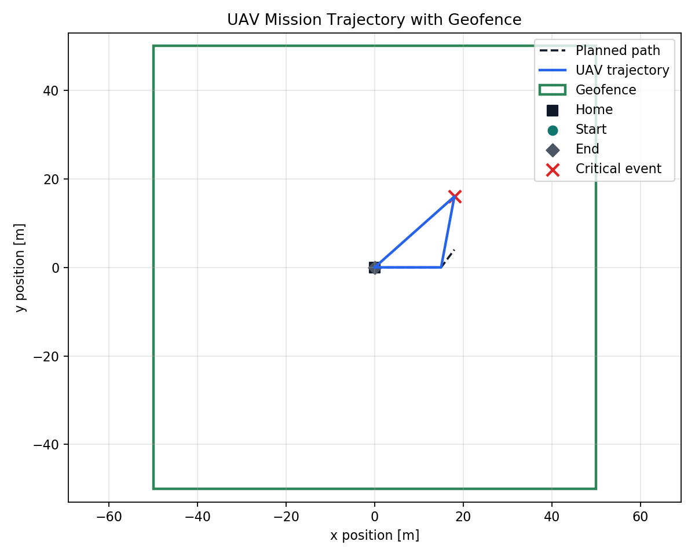
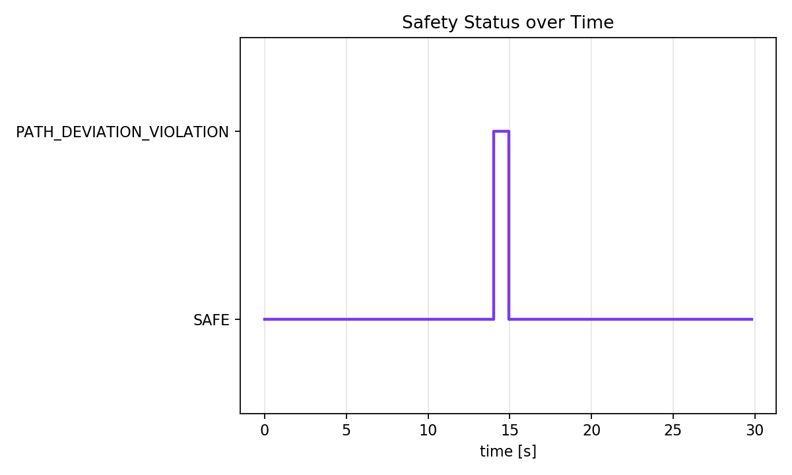

# Runtime Safety Monitoring for Autonomous UAV Missions

This repository is a small runtime safety-monitoring project for autonomous UAV
missions. It is not meant to be a full drone autopilot. The focus is narrower:
given a stream of UAV state data, the system checks whether the vehicle is still
inside its operational safety limits, records what happened, and recommends a
safe response.

The current implementation covers:

- waypoint-based UAV mission simulation in Python,
- runtime checks for altitude, geofence, battery, velocity, mission time,
  planned-path deviation, and stale state updates,
- safety status and recommended action generation,
- a simple mission supervisor for return-home and landing response modes,
- CSV logging, event extraction, scenario validation, and plots,
- ROS2/Gazebo Classic integration,
- PX4 Gazebo Classic live telemetry monitoring through ROS2.

The project was built as a compact UAV autonomy subsystem: the kind of component
that could sit beside mission planning or onboard autonomy software and provide
runtime situation assessment.

## What The Monitor Checks

The monitor receives UAV state samples with local position, velocity, battery,
mission time, mission state, and optional planned-position data. Each sample is
checked against the configured safety limits.

| Rule | Limit | Status | Action |
| --- | --- | --- | --- |
| Altitude warning | `z >= 25 m` and `z <= 30 m` | `ALTITUDE_WARNING` | `WARNING` |
| Altitude limit | `z > 30 m` | `ALTITUDE_LIMIT_VIOLATION` | `LAND` |
| Geofence warning | within `5 m` of boundary | `GEOFENCE_WARNING` | `WARNING` |
| Geofence violation | `x/y` outside `[-50, 50] m` | `GEOFENCE_VIOLATION` | `RETURN_TO_HOME` |
| Velocity limit | speed `> 10 m/s` | `VELOCITY_LIMIT_VIOLATION` | `RETURN_TO_HOME` |
| Path-deviation warning | deviation `>= 5 m` | `PATH_DEVIATION_WARNING` | `WARNING` |
| Path-deviation violation | deviation `> 10 m` | `PATH_DEVIATION_VIOLATION` | `RETURN_TO_HOME` |
| Low battery | `battery < 20%` | `LOW_BATTERY` | `LAND` |
| Mission timeout | mission time above limit | `MISSION_TIMEOUT` | `RETURN_TO_HOME` |
| State timeout | update gap `> 2 s` | `STATE_TIMEOUT` | `RETURN_TO_HOME` |

The default limits are in [config/safety_limits.json](config/safety_limits.json).
The PX4 live demo uses [config/px4_live_safety_limits.json](config/px4_live_safety_limits.json)
so the monitor can run longer during setup without turning the whole demo into a
mission-timeout case.

## Architecture


The same monitor logic is reused across three input sources:

```text
Python mission simulator
        |
        v
Runtime safety monitor -> mission supervisor -> CSV logs -> plots
```

```text
Gazebo Classic model state
        |
        v
ROS2 bridge -> /uav/state -> runtime safety monitor
```

```text
PX4 Gazebo Classic telemetry
        |
        v
/fmu/out/vehicle_local_position
        |
        v
px4_state_bridge -> /uav/raw_state
        |
        v
fault_injection -> /uav/state
        |
        v
runtime safety monitor -> safety console + live CSV logs
```

The fault-injection node is used only for repeatable live validation. It lets the
monitor see a controlled geofence, altitude, or battery fault while keeping one
consistent PX4-derived state stream.

## Repository Layout

Important files:

- [src/safety_monitor.py](src/safety_monitor.py): core runtime safety rules.
- [src/mission_supervisor.py](src/mission_supervisor.py): converts monitor output into response modes.
- [src/mission_simulator.py](src/mission_simulator.py): waypoint mission state generation.
- [src/simulation_runner.py](src/simulation_runner.py): connects simulation, monitor, supervisor, and logs.
- [analysis/analyze_logs.py](analysis/analyze_logs.py): summarizes mission logs.
- [analysis/plot_mission.py](analysis/plot_mission.py): creates trajectory, altitude, battery, safety, and supervisor plots.
- [uav_runtime_safety_monitor](uav_runtime_safety_monitor): ROS2 package nodes.
- [launch](launch): ROS2 launch files.
- [gazebo_extension](gazebo_extension): Gazebo Classic demo world and helper scripts.
- [px4_extension](px4_extension): PX4 SITL helper scripts and live-demo workflow.
- [docs/px4_live_demo.md](docs/px4_live_demo.md): tested PX4/Gazebo live telemetry runbook.

## Validation Scenarios

The Python validation layer generates repeatable missions and expected outcomes.

| Scenario | Injected condition | Expected status | Expected action |
| --- | --- | --- | --- |
| Normal mission | none | `SAFE` | `CONTINUE` |
| Geofence warning | UAV approaches the geofence boundary | `GEOFENCE_WARNING` | `WARNING` |
| Geofence violation | UAV crosses `x = 50 m` | `GEOFENCE_VIOLATION` | `RETURN_TO_HOME` |
| Unsafe geofence alias | same geofence violation, saved as `unsafe_mission.csv` | `GEOFENCE_VIOLATION` | `RETURN_TO_HOME` |
| Altitude violation | UAV climbs above `30 m` | `ALTITUDE_LIMIT_VIOLATION` | `LAND` |
| Low battery | battery drops below `20%` | `LOW_BATTERY` | `LAND` |
| Mission timeout | mission exceeds time limit | `MISSION_TIMEOUT` | `RETURN_TO_HOME` |
| State timeout | state update gap exceeds `2 s` | `STATE_TIMEOUT` | `RETURN_TO_HOME` |
| Velocity violation | UAV exceeds `10 m/s` | `VELOCITY_LIMIT_VIOLATION` | `RETURN_TO_HOME` |
| Path deviation | UAV drifts `12 m` from planned path | `PATH_DEVIATION_VIOLATION` | `RETURN_TO_HOME` |

Run the core validation:

```bash
python3 src/main.py
python3 analysis/validate_scenarios.py
python3 analysis/analyze_logs.py
python3 analysis/plot_mission.py
python3 -m unittest discover
```

## Results

In the normal mission, the UAV remains inside the geofence and below the altitude
limit, so all samples are `SAFE`.

In the geofence violation mission, the UAV first enters the warning margin and
then crosses the boundary. The monitor reports `GEOFENCE_VIOLATION`, recommends
`RETURN_TO_HOME`, and the supervisor switches to `RETURNING_HOME`.

The path-deviation mission is a more trajectory-focused case. The UAV remains
inside the geofence, but its actual position is shifted away from the planned
path during a waypoint segment. The monitor detects a `12 m` deviation from the
reference path and recommends `RETURN_TO_HOME`.






## PX4/Gazebo Live Telemetry Evidence

PX4 Gazebo Classic was connected to the same monitor through ROS2 telemetry. The
PX4 bridge converted `/fmu/out/vehicle_local_position` into the project state
format, then a short geofence fault was injected into that stream for a
repeatable live test.

Observed live event log:

```text
31.44,ENTERED_VIOLATION,...,GEOFENCE_VIOLATION,CRITICAL,RETURN_TO_HOME,...,"Position (60.0, 0.0) outside geofence"
37.90,CLEARED_EVENT,...,SAFE,INFO,CONTINUE,...,All monitored constraints satisfied
```

Live run summary:

```text
samples: 1859
non-safe samples: 62
event transitions: 2
first non-safe status: GEOFENCE_VIOLATION at t=31.4 s
recommended action: RETURN_TO_HOME
first supervisor response: RETURNING_HOME
```

Evidence files:

- [data/px4_live_mission.csv](data/px4_live_mission.csv)
- [data/px4_live_events.csv](data/px4_live_events.csv)


## How To Run

For the lightweight Python version:

```bash
git clone https://github.com/inteeed/uav_runtime_safety_monitor.git
cd uav_runtime_safety_monitor
python3 -m venv .venv
source .venv/bin/activate
python -m pip install -r requirements.txt
python src/main.py
python3 analysis/validate_scenarios.py
python3 analysis/plot_mission.py
```

For the ROS2/Gazebo Classic demo:

```bash
source /opt/ros/foxy/setup.bash
colcon build --symlink-install --packages-select uav_runtime_safety_monitor
source install/setup.bash
ros2 launch uav_runtime_safety_monitor gazebo_safety_demo.launch.py
```

Headless Gazebo validation:

```bash
./gazebo_extension/run_headless_demo.sh
```

For the PX4 Gazebo Classic live telemetry demo, use separate terminals:

```bash
# Terminal 1
cd /home/inteed/projects/uav-runtime-safety-monitor
HEADLESS=0 ./px4_extension/run_px4_gazebo_classic.sh
```

At the PX4 `pxh>` prompt:

```bash
commander takeoff
```

```bash
# Terminal 2
cd /home/inteed/projects/uav-runtime-safety-monitor
./px4_extension/run_micro_xrce_agent.sh
```

```bash
# Terminal 3
cd /home/inteed/projects/uav-runtime-safety-monitor
./px4_extension/run_px4_monitor_stack.sh
```

After the safety console shows `SAFE`, trigger a controlled geofence fault:

```bash
# Terminal 4
cd /home/inteed/projects/uav-runtime-safety-monitor
./px4_extension/inject_monitor_violation.sh geofence
```

Analyze the live run:

```bash
python3 analysis/analyze_logs.py data/px4_live_mission.csv
python3 analysis/plot_mission.py --input data/px4_live_mission.csv --prefix px4_live
```

More detail is in [docs/px4_live_demo.md](docs/px4_live_demo.md).

## Project Status

Working:

- Python scenario simulation and validation.
- Runtime monitor and mission supervisor.
- Velocity-limit and planned-path deviation monitoring.
- CSV logging and plotting.
- ROS2 package launch workflow.
- Gazebo Classic demo.
- PX4 Gazebo Classic telemetry bridge.
- Live PX4 telemetry safety-console output.
- Repeatable live fault injection for validation evidence.

Not implemented yet:

- sending `RETURN_TO_HOME` or `LAND` commands back into PX4,
- custom ROS2 message definitions,
- autopilot-driven unsafe waypoint mission,
- richer checks such as GPS loss, obstacle proximity, or sensor fault detection.

## Why This Is Relevant To UAV Autonomy

Autonomous UAVs need more than mission planning; they also need runtime
supervision. This project demonstrates a small safety layer that can sit between
state estimation, mission execution, and higher-level decision making. It uses
simulation, ROS2 topics, PX4 telemetry, logs, and plots to validate the monitor
instead of only showing isolated scripts.

The implementation is intentionally modest, but the structure is close to a real
onboard autonomy workflow:

```text
state source -> runtime monitor -> safety status -> supervisor response -> logs
```

## Future Work

The next improvements are planned in layers so the repository stays useful even
if a later PX4/Gazebo task becomes fragile.

### Short Term

- Replace JSON string topics with small custom ROS2 messages for UAV state,
  safety status, and supervisor response.
- Refine path-deviation monitoring with cross-track error and along-track error
  instead of only point-wise deviation from the reference trajectory.
- Add ROS2 bag recording and replay so live PX4 telemetry can be validated
  offline without restarting Gazebo.
- Add a small report script that summarizes each run and links the generated
  plots.

### Medium Term

- Add an autopilot-driven unsafe waypoint test where PX4 is commanded toward a
  geofence boundary and the monitor detects the violation from real telemetry.
- Add a guarded PX4 command bridge for `RETURN_TO_HOME` and `LAND`, disabled by
  default and enabled only in SITL.
- Process PX4 `.ulg` logs alongside the project CSV logs to compare monitor
  events with PX4 internal state.
- Add simulated GPS/state dropout and delayed-state checks for stale telemetry
  validation.

### Long Term

- Add richer Gazebo scenarios such as wind, sensor noise, and obstacle proximity.
- Add multi-UAV separation monitoring as a small swarm-safety extension.
- Add CI checks for tests, scenario validation, and plot generation.
- Add a short demo video after the repository evidence is stable.
